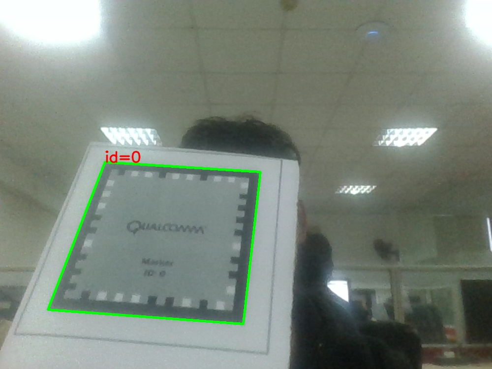

# Frame marker detector
> Frame marker detector using OpenCV

This is the library for detecting frame marker provided by Vuforia SDK using Python

## Installation

### Pre-install required

```
Python 3
OpenCV
Numpy
```

### Installation

Clone this repository
```
git clone https://github.com/hailiang194/frame-marker-detector.git
```

Import to your source code
```
import get_marker
```
execute ```get_marker.get_markers()``` function
```
    ids, corners, rejected = get_marker.get_markers(image)
```
which
```
ids : list of ids coresponding to corners
corners: contuors of markers
rejected: contuors which is not markers
```

## Usage example


